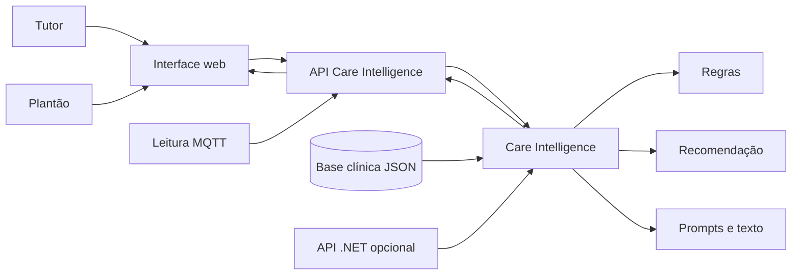
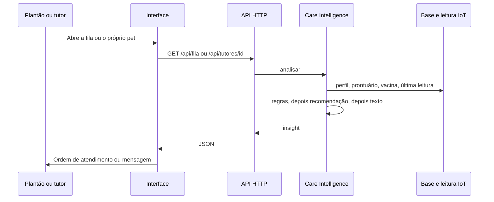

# Arquitetura

```mermaid
flowchart LR
    tutor[Tutor]
    plantao[Plantão]
    tela[Interface web]
    api[API Care Intelligence]
    base[(Base clínica JSON)]
    dotnet[API .NET opcional]
    sensor[Leitura MQTT]
    ia[Care Intelligence]
    regras[Regras]
    rec[Recomendação]
    texto[Prompts e texto]

    tutor --> tela
    plantao --> tela
    tela --> api
    sensor --> api
    api --> ia
    base --> ia
    dotnet --> ia
    ia --> regras
    ia --> rec
    ia --> texto
    ia --> api
    api --> tela
```

```mermaid
sequenceDiagram
    participant Usuario as Plantão ou tutor
    participant Tela as Interface
    participant API as API HTTP
    participant IA as Care Intelligence
    participant Dados as Base e leitura IoT

    Usuario->>Tela: Abre a fila ou o próprio pet
    Tela->>API: GET /api/fila ou /api/tutores/id
    API->>IA: analisar
    IA->>Dados: perfil, prontuário, vacina, última leitura
    IA->>IA: regras, depois recomendação, depois texto
    IA->>API: insight
    API->>Tela: JSON
    Tela->>Usuario: Ordem de atendimento ou mensagem
```

A leitura nova entra por `POST /api/leituras`, passa pela validação e só então reentra no mesmo ciclo.
